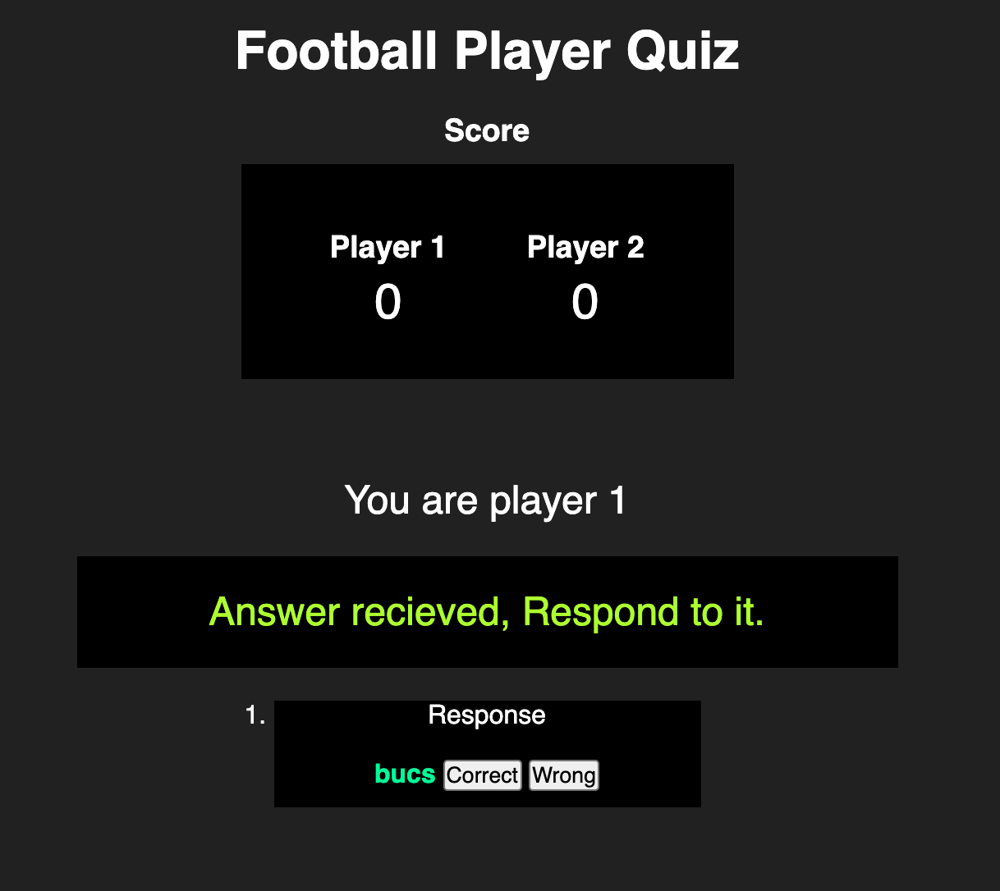

# Web Socket Football Questionnaire

This web app uses websockets instead of http to communicate between clients. The idea of this project was to send a football player question between clients while adding a point to the score board if player 1 or 2 get the correct answer. Players receiving the question will send an answer to the other client, that same client then determines if the answer is correct or wrong.

